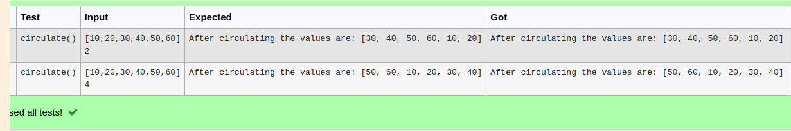

# Circulate-the-values-of-N-variables
## Aim:
To write a python program to circulate the n variables using function concept
## Equipment’s required:
PC
Anaconda - Python 3.7
## Algorithm: 
### Step 1: 
### Step 2: 
### Step 3: 
Get the value from the user for the number of rotation
### Step 4: 
Using the slicing concept rotate the list

### Step 5: 
### Step 6: 
## Program:
```
#Program to circulate N values.
#Developed by: PRAVEEN D
#RegisterNumber: 22005917
def circulate():
    a=eval(input())
    n=int(input())
    a=a[n:]+a[:n]
    print("After circulating the values are:",a)
```    
## Output:


## Result:
thus the circulating the values of N_variables are successfully executed
